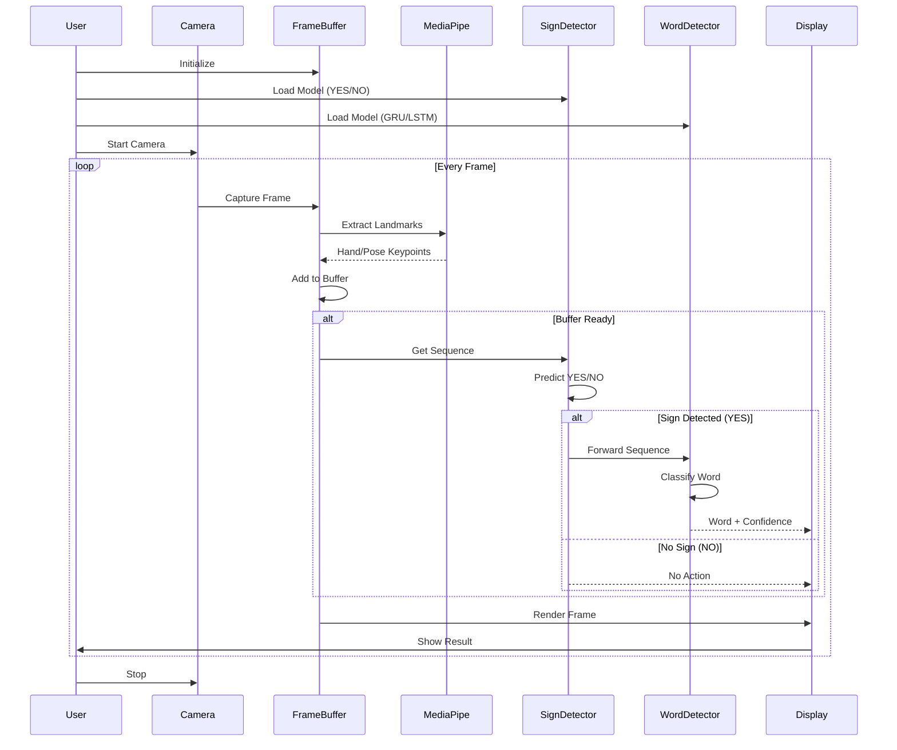

# Sign Language Detection Pipeline - Sequence Diagram



## Pipeline Components

- **FrameBuffer**: Manages sliding window of frames and landmarks
- **MediaPipe**: Extracts hand/pose keypoints (126 or 227 dims)
- **SignDetector**: Binary classifier for YES/NO detection (LSTM/Transformer)
- **WordDetector**: Multi-class word classifier (GRU/LSTM)

## Pipeline Flow

```
Camera → FrameBuffer → MediaPipe → Landmark Buffer
                                         ↓
                                   SignDetector (YES/NO)
                                         ↓
                              [If YES] → WordDetector → Display
```
